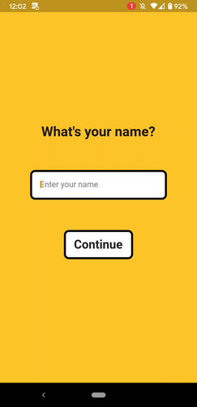
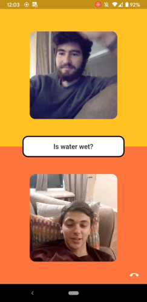

# Discourse

This is an app built in about 8-12 hours for an online hackathon. It is intended to help fight division in our society
by encouraging thoughtful discourse between opposite sides. The premise of the app is simple: 
it shows you a question which you respond to, matches you with someone of a dissenting
opinion, and connects you in a video chat so you can hear each other's thoughts.

 

## Tech Stack

- Flutter
- Firebase (database, functions, auth)
- Agora

## License

This software is under the MIT License (MIT).
